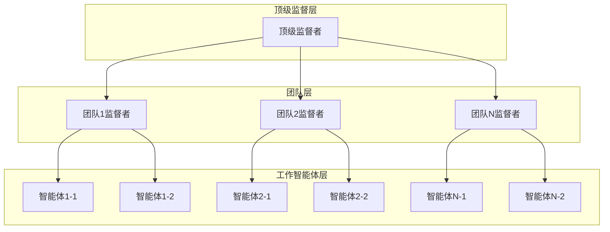
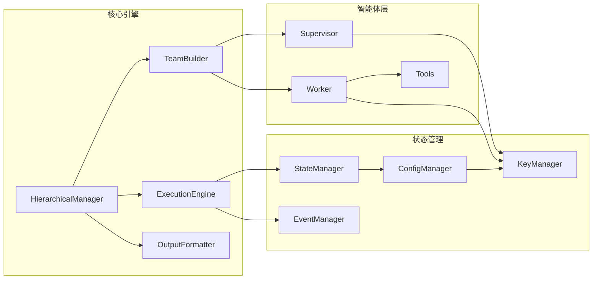

# 设计文档

## 概述

本系统基于LangGraph框架实现分层多智能体协作模式，采用监督者-工作者（Supervisor-Worker）架构。系统支持动态构建具有依赖关系的智能体团队，通过分层监督机制实现复杂任务的分解和协调执行。

核心设计理念：
- **分层架构**：顶级监督者 → 中级监督者 → 工作智能体
- **流式执行**：实时状态更新和结果流式返回
- **标准化输出**：统一的结果格式和错误处理
- **可扩展性**：插件化的智能体和工具管理

## 架构

### 系统架构图



### 核心组件架构



## 组件和接口

### 1. 核心管理器

#### HierarchicalManager
```python
class HierarchicalManager:
    """分层多智能体系统的主管理器"""
    
    def build_hierarchy(self, team_config: dict) -> HierarchicalTeam
    def execute_team(self, team: HierarchicalTeam, context: ExecutionContext) -> AsyncIterator[ExecutionEvent]
    def format_results(self, execution_results: List[TeamResult]) -> StandardizedOutput
```

#### TeamBuilder
```python
class TeamBuilder:
    """团队构建器，负责创建分层团队结构"""
    
    def create_team(self, sub_team: SubTeam) -> AgentTeam
    def create_supervisor(self, team_members: List[str]) -> SupervisorAgent
    def build_dependency_graph(self, dependencies: Dict[str, List[str]]) -> DependencyGraph
```

### 2. 智能体组件

#### SupervisorAgent
```python
class SupervisorAgent:
    """监督者智能体，负责任务分配和协调"""
    
    def __init__(self, config: SupervisorConfig):
        self.config = config
        self.llm = ChatOpenAI(model=config.model, temperature=config.temperature)
    
    def route_task_intelligently(self, task: str, available_agents: List[Agent]) -> Agent:
        """使用LLM智能路由任务到最适合的智能体"""
        agent_descriptions = self._format_agent_info(available_agents)
        
        routing_prompt = self.config.user_prompt.format(
            task=task,
            available_members=agent_descriptions,
            team_goal=self._get_team_goal(),
            current_progress=self._get_current_progress()
        )
        
        response = self.llm.invoke([
            {"role": "system", "content": self.config.system_prompt},
            {"role": "user", "content": routing_prompt}
        ])
        
        selected_agent_name = response.content.strip()
        return self._find_agent_by_name(available_agents, selected_agent_name)
    
    def route_task_structured(self, task: str, available_agents: List[Agent]) -> Tuple[Agent, str]:
        """使用结构化输出进行路由，返回选中的智能体和理由"""
        agent_names = [agent.agent_name for agent in available_agents]
        
        class RoutingResult(TypedDict):
            selected_agent: str
            reasoning: str
        
        result = self.llm.with_structured_output(RoutingResult).invoke([
            {"role": "system", "content": self.config.system_prompt},
            {"role": "user", "content": f"任务: {task}\n可选智能体: {agent_names}\n请选择最适合的智能体并说明理由。"}
        ])
        
        selected_agent = self._find_agent_by_name(available_agents, result["selected_agent"])
        return selected_agent, result["reasoning"]
    
    def _format_agent_info(self, agents: List[Agent]) -> str:
        """格式化智能体信息供路由决策使用"""
        return "\n".join([
            f"- {agent.agent_name}: {agent.config.system_prompt[:100]}..."
            for agent in agents
        ])
```

#### WorkerAgent
```python
class WorkerAgent:
    """工作智能体，执行具体任务"""
    
    def __init__(self, config: AgentConfig, key_manager: KeyManager):
        self.config = config
        self.llm = key_manager.get_llm_client(
            config.llm_config.provider, 
            config.llm_config.model
        )
    
    def execute_task(self) -> AgentResult:
        """执行智能体任务"""
        messages = [
            {"role": "system", "content": self.config.system_prompt},
            {"role": "user", "content": self.config.user_prompt}
        ]
        return self.llm.invoke(messages)
    
    def use_tools(self, tools: List[Tool]) -> Any:
        """使用工具执行任务"""
        pass
```

### 3. 密钥管理

#### KeyManager
```python
class KeyManager:
    """LLM密钥管理器，支持多种LLM提供商"""
    
    def get_llm_client(self, provider: str, model: str) -> BaseLLM:
        """根据提供商和模型获取LLM客户端"""
        
    def validate_key(self, provider: str, api_key: str) -> bool:
        """验证API密钥有效性"""
        
    def rotate_key(self, provider: str, old_key: str, new_key: str) -> bool:
        """密钥轮换"""
        
    def get_usage_stats(self, provider: str) -> UsageStats:
        """获取使用统计"""

class LLMProviderConfig:
    """LLM提供商配置"""
    
    def __init__(self, provider: str, config: dict):
        self.provider = provider
        self.config = config
    
    def create_client(self) -> BaseLLM:
        """创建LLM客户端"""
        if self.provider == "openai":
            return self._create_openai_client()
        elif self.provider == "openrouter":
            return self._create_openrouter_client()
        elif self.provider == "aws_bedrock":
            return self._create_bedrock_client()
        else:
            raise ValueError(f"Unsupported provider: {self.provider}")
```

### 4. 执行引擎

#### ExecutionEngine
```python
class ExecutionEngine:
    """执行引擎，管理整个执行流程"""
    
    def start_execution(self, team: HierarchicalTeam, config: ExecutionConfig) -> ExecutionSession
    def stream_events(self, session: ExecutionSession) -> AsyncIterator[ExecutionEvent]
    def handle_errors(self, error: Exception, context: ExecutionContext) -> ErrorResponse
```

#### StateManager
```python
class StateManager:
    """状态管理器，维护执行状态"""
    
    def update_state(self, team_id: str, state: TeamState) -> None
    def get_current_state(self, team_id: str) -> TeamState
    def persist_state(self, session_id: str) -> None
```

## 数据模型

### 核心数据结构

```python
@dataclass
class SupervisorConfig:
    """监督者配置"""
    llm_config: LLMConfig            # LLM配置
    system_prompt: str               # 系统提示词
    user_prompt: str                 # 用户提示词，包含具体的执行指令
    max_iterations: int = 10         # 最大迭代次数

@dataclass
class SubTeam:
    """子团队定义"""
    id: str
    name: str
    description: str
    supervisor_config: SupervisorConfig  # 子团队监督者配置
    agent_configs: List[AgentConfig]

@dataclass
class AgentConfig:
    """智能体配置"""
    agent_id: str                    # 智能体唯一标识符
    agent_name: str                  # 智能体名称，用于显示、日志和路由决策
    llm_config: LLMConfig            # LLM配置
    system_prompt: str               # 系统提示词，定义智能体的角色和行为规范
    user_prompt: str                 # 用户提示词，包含具体的任务指令
    tools: List[str]                 # 可用工具列表
    max_iterations: int = 10         # 最大迭代次数

@dataclass
class GlobalConfig:
    """全局配置"""
    max_execution_time: int = 3600      # 最大执行时间（秒）
    enable_streaming: bool = True       # 是否启用流式输出
    output_format: str = "detailed"     # 输出格式：detailed|summary|minimal

@dataclass
class HierarchicalTeam:
    """分层团队结构"""
    team_name: str
    description: str
    top_supervisor_config: SupervisorConfig  # 顶级监督者配置
    sub_teams: List[SubTeam]            # 子团队列表
    dependencies: Dict[str, List[str]]  # 依赖关系
    global_config: GlobalConfig         # 全局配置
    # 运行时字段
    top_supervisor: Optional[SupervisorAgent] = None
    teams: Optional[Dict[str, AgentTeam]] = None
    dependency_graph: Optional[DependencyGraph] = None
    execution_order: Optional[List[str]] = None

@dataclass
class ExecutionEvent:
    """执行事件"""
    timestamp: datetime
    event_type: str                  # 事件类型：execution_started, supervisor_routing, agent_started等
    source_type: str                 # 事件来源：system, supervisor, agent
    execution_id: str                # 执行ID
    team_id: Optional[str] = None    # 团队ID
    supervisor_id: Optional[str] = None  # 监督者ID
    supervisor_name: Optional[str] = None  # 监督者名称
    agent_id: Optional[str] = None   # 智能体ID
    agent_name: Optional[str] = None # 智能体名称
    content: Optional[str] = None    # 事件内容
    action: Optional[str] = None     # 执行动作
    status: Optional[str] = None     # 状态
    progress: Optional[int] = None   # 进度百分比
    result: Optional[str] = None     # 执行结果
    selected_team: Optional[str] = None    # 选中的团队
    selected_agent: Optional[str] = None   # 选中的智能体

@dataclass
class ExecutionSummary:
    """执行摘要"""
    status: str
    started_at: datetime
    completed_at: Optional[datetime] = None
    total_duration: Optional[int] = None
    teams_executed: int = 0
    agents_involved: int = 0

@dataclass
class TeamResult:
    """团队执行结果"""
    status: str
    duration: Optional[int] = None
    agents: Dict[str, Any] = None
    output: Optional[str] = None

@dataclass
class ErrorInfo:
    """错误信息"""
    error_code: str
    message: str
    timestamp: datetime
    context: Optional[Dict[str, Any]] = None

@dataclass
class ExecutionMetrics:
    """执行指标"""
    total_tokens_used: int = 0
    api_calls_made: int = 0
    success_rate: float = 0.0
    average_response_time: float = 0.0

@dataclass
class StandardizedOutput:
    """标准化输出格式"""
    execution_id: str
    execution_summary: ExecutionSummary
    team_results: Dict[str, TeamResult]
    errors: List[ErrorInfo]
    metrics: ExecutionMetrics

@dataclass
class ExecutionConfig:
    """执行配置"""
    stream_events: bool = True       # 是否启用流式事件
    save_intermediate_results: bool = True  # 是否保存中间结果
    max_parallel_teams: int = 1      # 最大并行团队数

@dataclass
class LLMConfig:
    """LLM配置"""
    provider: str                    # 提供商：openai, openrouter, aws_bedrock
    model: str                       # 模型名称
    base_url: Optional[str] = None   # 自定义API端点
    region: Optional[str] = None     # AWS区域（仅Bedrock需要）
    temperature: float = 0.7
    max_tokens: Optional[int] = None
    timeout: int = 30


@dataclass
class ExecutionContext:
    """执行上下文"""
    execution_id: str
    team_id: str
    config: ExecutionConfig          # 执行配置
    started_at: datetime
    current_team: Optional[str] = None
```

### 状态模型

```python
class TeamState(MessagesState):
    """团队状态，扩展自LangGraph的MessagesState"""
    next: str
    team_id: str
    dependencies_met: bool
    execution_status: ExecutionStatus
    current_agent: Optional[str] = None

class ExecutionStatus(Enum):
    """执行状态枚举"""
    PENDING = "pending"
    RUNNING = "running"
    COMPLETED = "completed"
    FAILED = "failed"
    PAUSED = "paused"
```

### 智能体字段说明

#### 简化后的字段设计：

**字段定义：**

- **agent_id**: 系统内部唯一标识符，用于技术层面的引用和数据库存储
- **agent_name**: 智能体名称，既用于显示也用于路由决策，语义化表达智能体的功能和专长
- **tools**: 智能体可用的具体工具列表，直接定义智能体的功能边界

**设计理念：**
- 使用语义化的`agent_name`直接表达智能体的功能，如"医疗文献搜索专家"、"趋势分析师"
- 监督者可以基于`agent_name`的语义进行智能路由
- `tools`列表明确定义智能体的实际能力，无需额外的能力标签

**监督者路由逻辑：**
```python
# 基于agent_name的语义路由
def route_task(task_description: str, available_agents: List[Agent]):
    # 使用LLM进行语义匹配
    routing_prompt = f"""
    任务描述: {task_description}
    可用智能体: {[agent.agent_name for agent in available_agents]}
    
    请选择最适合执行此任务的智能体。
    """
    
    # 或者基于关键词匹配
    if "搜索" in task_description or "收集信息" in task_description:
        return find_agent_by_name_pattern("搜索专家")
    elif "分析" in task_description or "数据处理" in task_description:
        return find_agent_by_name_pattern("分析师")
    elif "写作" in task_description or "文档" in task_description:
        return find_agent_by_name_pattern("写作专家")
```

**优势：**
- **简化设计**: 减少冗余字段，降低配置复杂度
- **语义清晰**: agent_name直接表达功能，无需额外映射
- **灵活路由**: 支持基于名称语义的智能路由
- **易于理解**: 用户和开发者都能直观理解智能体功能

#### 智能路由示例：
```python
# 监督者使用LLM进行智能路由决策
def route_task_with_llm(supervisor: SupervisorAgent, task_description: str, available_agents: List[Agent]):
    # 构建路由提示词
    agent_info = "\n".join([
        f"- {agent.agent_name}: {agent.system_prompt[:100]}..."
        for agent in available_agents
    ])
    
    routing_prompt = f"""
任务描述: {task_description}

可用智能体:
{agent_info}

请分析任务需求，选择最适合执行此任务的智能体。只返回智能体名称。
"""
    
    # 使用监督者的LLM进行路由决策
    response = supervisor.llm.invoke([
        {"role": "system", "content": supervisor.system_prompt},
        {"role": "user", "content": routing_prompt}
    ])
    
    selected_agent_name = response.content.strip()
    return find_agent_by_name(available_agents, selected_agent_name)

# 或者使用结构化输出确保路由准确性
from typing import Literal

class RoutingDecision(TypedDict):
    """路由决策结构化输出"""
    selected_agent: str
    reasoning: str

def route_task_structured(supervisor: SupervisorAgent, task_description: str, available_agents: List[Agent]):
    agent_names = [agent.agent_name for agent in available_agents]
    
    # 动态创建Literal类型
    AgentChoice = Literal[tuple(agent_names)]
    
    class RouterOutput(TypedDict):
        selected_agent: AgentChoice
        reasoning: str
    
    routing_prompt = f"""
任务: {task_description}
可选智能体: {agent_names}

请选择最适合的智能体并说明理由。
"""
    
    result = supervisor.llm.with_structured_output(RouterOutput).invoke([
        {"role": "system", "content": supervisor.system_prompt},
        {"role": "user", "content": routing_prompt}
    ])
    
    return find_agent_by_name(available_agents, result["selected_agent"])
```

### 提示词设计说明

#### 简化的提示词架构：

- **system_prompt**: 
  - **用途**: 定义智能体的身份、角色和基本行为规范
  - **特点**: 静态内容，在智能体创建时确定，整个生命周期保持不变
  - **内容**: 角色定义、能力描述、行为准则、输出要求等
  - **示例**: "你是一个专业的信息搜索专家，擅长使用各种搜索工具收集准确、相关的信息。"

#### 运行时提示词处理：
```python
# 执行时，智能体直接使用配置中的system_prompt和user_prompt
def execute_agent(agent: Agent) -> AgentResult:
    messages = [
        {"role": "system", "content": agent.config.system_prompt},
        {"role": "user", "content": agent.config.user_prompt}
    ]
    return agent.llm.invoke(messages)

# 监督者执行路由决策
def execute_supervisor_routing(supervisor: SupervisorAgent, available_options: List[str]) -> str:
    # 构建可选项信息
    options_info = "\n".join([f"- {option}" for option in available_options])
    
    # 动态构建路由prompt
    routing_prompt = f"""
{supervisor.config.user_prompt}

可选项:
{options_info}

请选择最适合的选项。
"""
    
    messages = [
        {"role": "system", "content": supervisor.config.system_prompt},
        {"role": "user", "content": routing_prompt}
    ]
    
    response = supervisor.llm.invoke(messages)
    return response.content.strip()
```

#### 设计优势：
- **配置与执行分离**: 任务定义在创建时完成，执行时专注于流程控制
- **简化架构**: 移除了复杂的模板渲染和参数传递
- **职责清晰**: 智能体配置包含完整的执行指令
- **易于维护**: 减少了运行时的复杂性

#### 执行流程示例：
```python
# 1. 顶级监督者选择子团队
selected_team = execute_supervisor_routing(
    top_supervisor, 
    ["研究团队", "写作团队"]
)

# 2. 子团队监督者选择智能体
selected_agent = execute_supervisor_routing(
    team_supervisor,
    ["医疗文献搜索专家", "趋势分析师"]
)

# 3. 执行选中的智能体
result = execute_agent(selected_agent)
```

#### 设计理念：
- **一次配置，多次执行**: 团队创建时定义所有任务，执行时按流程运行
- **智能路由**: 监督者基于预设指令进行智能决策
- **结果传递**: 通过依赖关系自动传递上游结果给下游团队

## 错误处理

### 错误分类和处理策略

```python
class ErrorHandler:
    """统一错误处理器"""
    
    def handle_agent_error(self, error: AgentError) -> ErrorResponse:
        """处理智能体执行错误"""
        if error.is_recoverable:
            return self.retry_with_backoff(error.context)
        else:
            return self.graceful_degradation(error.context)
    
    def handle_network_error(self, error: NetworkError) -> ErrorResponse:
        """处理网络相关错误"""
        return self.implement_circuit_breaker(error)
    
    def handle_supervisor_failure(self, supervisor_id: str) -> ErrorResponse:
        """处理监督者失效"""
        return self.reassign_supervision(supervisor_id)
```

### 错误恢复机制

1. **重试机制**：指数退避重试，最大重试次数限制
2. **降级处理**：关键组件失效时的功能降级
3. **监督者重分配**：监督者失效时的职责转移
4. **部分结果返回**：系统异常时返回已完成的部分结果

## 测试策略

### 单元测试
- **组件测试**：每个核心组件的独立功能测试
- **智能体测试**：监督者和工作智能体的行为测试
- **状态管理测试**：状态转换和持久化测试

### 集成测试
- **团队协作测试**：多智能体协作流程测试
- **依赖关系测试**：复杂依赖关系的执行测试
- **错误处理测试**：各种异常场景的处理测试

### 性能测试
- **并发执行测试**：多团队并发执行的性能测试
- **大规模团队测试**：大量智能体的扩展性测试
- **流式输出测试**：实时数据流的性能测试

### 端到端测试
- **完整工作流测试**：从团队构建到结果输出的完整流程
- **真实场景测试**：模拟实际业务场景的综合测试
- **用户接受度测试**：API接口和输出格式的用户验证

## 环境变量密钥管理设计

### 设计原则
1. **环境变量存储**：所有API密钥通过环境变量提供，简单安全
2. **标准命名约定**：使用标准的环境变量命名（OPENAI_API_KEY等）
3. **运行时读取**：系统启动时从环境变量读取密钥，无需持久化存储
4. **配置简化**：配置文件中不包含密钥信息，只包含提供商和模型配置
5. **开发友好**：支持.env文件进行本地开发配置

### 环境变量命名约定

#### OpenAI
```bash
OPENAI_API_KEY=sk-your-openai-api-key-here
```

#### OpenRouter  
```bash
OPENROUTER_API_KEY=sk-or-your-openrouter-api-key-here
```

#### AWS Bedrock
```bash
AWS_ACCESS_KEY_ID=your-aws-access-key-id
AWS_SECRET_ACCESS_KEY=your-aws-secret-access-key
AWS_SESSION_TOKEN=your-aws-session-token  # 可选
AWS_DEFAULT_REGION=us-east-1
```

### 简化的LLM配置

#### OpenAI配置
```python
openai_config = LLMConfig(
    provider="openai",
    model="gpt-4o",
    temperature=0.7,
    max_tokens=2000
)
```

#### OpenRouter配置
```python
openrouter_config = LLMConfig(
    provider="openrouter", 
    model="anthropic/claude-3-sonnet",
    base_url="https://openrouter.ai/api/v1",
    temperature=0.5
)
```

#### AWS Bedrock配置
```python
bedrock_config = LLMConfig(
    provider="aws_bedrock",
    model="anthropic.claude-3-sonnet-20240229-v1:0",
    region="us-east-1",
    temperature=0.3
)
```

### 环境变量密钥管理器实现
```python
class EnvironmentKeyManager:
    """从环境变量读取API密钥的简化管理器"""
    
    def __init__(self):
        self.key_mappings = {
            "openai": "OPENAI_API_KEY",
            "openrouter": "OPENROUTER_API_KEY", 
            "aws_bedrock": ["AWS_ACCESS_KEY_ID", "AWS_SECRET_ACCESS_KEY"]
        }
    
    def get_key(self, provider: str) -> str:
        """从环境变量获取指定提供商的API密钥"""
        if provider not in self.key_mappings:
            raise ValueError(f"Unsupported provider: {provider}")
        
        env_var = self.key_mappings[provider]
        
        if provider == "aws_bedrock":
            # AWS需要多个环境变量
            access_key = os.getenv("AWS_ACCESS_KEY_ID")
            secret_key = os.getenv("AWS_SECRET_ACCESS_KEY")
            session_token = os.getenv("AWS_SESSION_TOKEN")
            
            if not access_key or not secret_key:
                raise ValueError("AWS credentials not found in environment variables")
            
            if session_token:
                return f"{access_key}:{secret_key}:{session_token}"
            return f"{access_key}:{secret_key}"
        else:
            # 其他提供商使用单个环境变量
            api_key = os.getenv(env_var)
            if not api_key:
                raise ValueError(f"API key not found in environment variable: {env_var}")
            return api_key
    
    def validate_key_format(self, provider: str, api_key: str) -> bool:
        """验证API密钥格式"""
        if provider == "openai":
            return api_key.startswith("sk-") and len(api_key) > 20
        elif provider == "openrouter":
            return api_key.startswith("sk-or-") and len(api_key) > 20
        elif provider == "aws_bedrock":
            parts = api_key.split(":")
            return len(parts) >= 2 and len(parts[0]) >= 16
        return len(api_key.strip()) > 0
```

## 技术选型

### 核心框架
- **LangGraph**：智能体编排和状态管理
- **LangChain**：LLM集成和工具管理
- **AsyncIO**：异步执行和流式处理

### 支持技术
- **Pydantic**：数据验证和序列化
- **Redis**：状态缓存和会话管理
- **FastAPI**：REST API接口
- **WebSocket**：实时事件推送
- **python-dotenv**：环境变量管理
- **boto3**：AWS Bedrock集成

### 可选扩展
- **Prometheus**：监控和指标收集
- **Grafana**：可视化监控面板
- **Docker**：容器化部署
- **Kubernetes**：集群管理和扩展

## HTTP API接口设计

### 1. 创建分层团队接口

#### POST /api/v1/hierarchical-teams
创建新的分层团队结构

**请求体：**
```json
{
  "team_name": "research_analysis_team",
  "description": "研究分析团队",
  "top_supervisor_config": {
    "llm_config": {
      "provider": "openai",
      "model": "gpt-4o",
      "temperature": 0.3,
      "max_tokens": 1000
    },
    "system_prompt": "你是一个顶级监督者，负责协调和管理整个分层团队的执行。你需要根据任务需求、团队能力和依赖关系，智能地选择最适合的子团队执行任务。请基于任务特点和团队专长做出最优决策。",
    "user_prompt": "请协调整个分层团队执行研究分析任务。根据子团队的专长和依赖关系，选择最适合的子团队开始执行。只返回团队名称。",
    "max_iterations": 10
  },
  "sub_teams": [
    {
      "id": "team_a7b9c2d4e5f6",
      "name": "研究团队",
      "description": "负责信息收集和研究",
      "supervisor_config": {
        "llm_config": {
          "provider": "openai",
          "model": "gpt-4o",
          "temperature": 0.3
        },
        "system_prompt": "你是研究团队的监督者，负责协调信息搜索和数据分析工作。你需要根据任务特点和团队成员的专长，智能地选择最适合的成员执行任务。请基于成员能力和任务需求做出最优分配。",
        "user_prompt": "请协调研究团队执行信息收集和分析工作。根据团队成员的专长，选择最适合的成员开始执行。只返回成员名称。",
        "max_iterations": 8
      },
      "agent_configs": [
        {
          "agent_id": "agent_search_001",
          "agent_name": "医疗文献搜索专家",
          "llm_config": {
            "provider": "openrouter",
            "model": "anthropic/claude-3-sonnet",
            "base_url": "https://openrouter.ai/api/v1",
            "temperature": 0.3,
            "max_tokens": 2000
          },
          "system_prompt": "你是一个专业的信息搜索专家，擅长使用各种搜索工具收集准确、相关的信息。请始终提供可靠的信息源，并对搜索结果进行初步筛选。",
          "user_prompt": "请搜索人工智能在医疗领域的最新应用研究。重点收集深度学习在医学影像、自然语言处理在病历分析等领域的研究论文和技术进展。确保信息来源可靠，并进行初步筛选。",
          "tools": ["tavily_search", "web_scraper"],
          "max_iterations": 5
        },
        {
          "agent_id": "agent_analyze_001", 
          "agent_name": "趋势分析师",
          "llm_config": {
            "provider": "aws_bedrock",
            "model": "anthropic.claude-3-sonnet-20240229-v1:0",
            "region": "us-east-1",
            "temperature": 0.5,
            "max_tokens": 3000
          },
          "system_prompt": "你是一个数据分析专家，能够从复杂的信息中提取关键洞察，识别趋势和模式。请提供结构化的分析结果。",
          "user_prompt": "请分析AI医疗应用的技术趋势、挑战和机遇。基于收集到的研究资料，识别关键技术发展模式，分析数据隐私、算法可解释性、监管合规等挑战，并提供结构化的分析结果。",
          "tools": ["data_processor"],
          "max_iterations": 3
        }
      ]
    },
    {
      "id": "team_x8y9z1a2b3c4",
      "name": "写作团队",
      "description": "负责文档编写和整理",
      "supervisor_config": {
        "llm_config": {
          "provider": "openai",
          "model": "gpt-4o",
          "temperature": 0.5
        },
        "system_prompt": "你是写作团队的监督者，负责协调文档撰写工作。你需要根据写作任务的类型和复杂度，智能地选择最适合的写作专家。请确保任务分配能够产出高质量、结构清晰的文档。",
        "user_prompt": "请协调写作团队执行文档撰写工作。根据团队成员的专长和输入材料，选择最适合的成员开始执行。只返回成员名称。",
        "max_iterations": 6
      },
      "agent_configs": [
        {
          "agent_id": "agent_write_001",
          "agent_name": "技术报告撰写专家",
          "llm_config": {
            "provider": "openai",
            "model": "gpt-4o",
            "temperature": 0.7,
            "max_tokens": 4000
          },
          "system_prompt": "你是一个专业的技术写作专家，擅长将复杂的技术信息转化为清晰、易懂的文档。请确保内容结构合理、逻辑清晰。",
          "user_prompt": "请基于研究团队提供的材料，撰写一份关于人工智能在医疗领域应用的详细分析报告。报告应包含技术背景、应用案例、挑战分析和未来展望四个主要部分，确保内容结构合理、逻辑清晰。",
          "tools": ["document_writer", "editor"],
          "max_iterations": 5
        }
      ]
    }
  ],
  "dependencies": {
    "team_x8y9z1a2b3c4": ["team_a7b9c2d4e5f6"]
  },
  "global_config": {
    "max_execution_time": 3600,
    "enable_streaming": true,
    "output_format": "detailed"
  }
}
```

**响应：**
```json
{
  "success": true,
  "code": "TEAM_CREATED",
  "data": {
    "team_id": "ht_123456789",
    "team_name": "research_analysis_team",
    "status": "created",
    "created_at": "2024-01-15T10:30:00Z",
    "sub_teams_count": 2,
    "total_agents": 3,
    "execution_order": ["team_a7b9c2d4e5f6", "team_x8y9z1a2b3c4"]
  },
  "message": "分层团队创建成功"
}
```

### 2. 触发分层团队执行接口

#### POST /api/v1/hierarchical-teams/{team_id}/execute
触发指定分层团队执行任务

**路径参数：**
- `team_id`: 团队ID

**请求体：**
```json
{
  "execution_config": {
    "stream_events": true,
    "save_intermediate_results": true,
    "max_parallel_teams": 2
  }
}
```

**响应：**
```json
{
  "success": true,
  "code": "EXECUTION_STARTED",
  "data": {
    "execution_id": "exec_987654321",
    "team_id": "ht_123456789",
    "status": "started",
    "started_at": "2024-01-15T10:35:00Z",
    "stream_url": "/api/v1/executions/exec_987654321/stream",
    "estimated_duration": 1800
  },
  "message": "团队执行已启动"
}
```

### 3. 流式事件接口

#### GET /api/v1/executions/{execution_id}/stream
获取执行过程的实时事件流（Server-Sent Events）

**路径参数：**
- `execution_id`: 执行ID

**响应（SSE流）：**
```
event: execution_started
data: {"timestamp": "2024-01-15T10:35:00Z", "execution_id": "exec_987654321", "status": "started", "source_type": "system"}

event: supervisor_routing
data: {"timestamp": "2024-01-15T10:35:05Z", "source_type": "supervisor", "supervisor_id": "supervisor_main", "supervisor_name": "顶级监督者", "team_id": "ht_123456789", "action": "routing", "content": "分析任务需求，选择研究团队开始执行", "selected_team": "team_a7b9c2d4e5f6"}

event: supervisor_routing
data: {"timestamp": "2024-01-15T10:35:10Z", "source_type": "supervisor", "supervisor_id": "supervisor_a7b9c2d4e5f6", "supervisor_name": "研究团队监督者", "team_id": "team_a7b9c2d4e5f6", "action": "routing", "content": "根据任务特点，选择医疗文献搜索专家执行搜索任务", "selected_agent": "agent_search_001"}

event: agent_started
data: {"timestamp": "2024-01-15T10:35:15Z", "source_type": "agent", "team_id": "team_a7b9c2d4e5f6", "agent_id": "agent_search_001", "agent_name": "医疗文献搜索专家", "action": "started", "content": "开始搜索AI医疗应用相关信息", "status": "running"}

event: agent_progress
data: {"timestamp": "2024-01-15T10:37:30Z", "source_type": "agent", "team_id": "team_a7b9c2d4e5f6", "agent_id": "agent_search_001", "agent_name": "医疗文献搜索专家", "action": "progress", "content": "已找到5篇相关研究论文", "progress": 30}

event: agent_completed
data: {"timestamp": "2024-01-15T10:40:30Z", "source_type": "agent", "team_id": "team_a7b9c2d4e5f6", "agent_id": "agent_search_001", "agent_name": "医疗文献搜索专家", "action": "completed", "result": "已收集到15篇相关研究论文，包括深度学习在医学影像等领域的最新进展", "status": "completed"}

event: supervisor_routing
data: {"timestamp": "2024-01-15T10:40:45Z", "source_type": "supervisor", "supervisor_id": "supervisor_a7b9c2d4e5f6", "supervisor_name": "研究团队监督者", "team_id": "team_a7b9c2d4e5f6", "action": "routing", "content": "搜索完成，现在选择趋势分析师进行数据分析", "selected_agent": "agent_analyze_001"}

event: team_transition
data: {"timestamp": "2024-01-15T10:50:00Z", "source_type": "supervisor", "supervisor_id": "supervisor_main", "supervisor_name": "顶级监督者", "action": "team_transition", "from_team": "team_a7b9c2d4e5f6", "to_team": "team_x8y9z1a2b3c4", "content": "研究阶段完成，转入写作阶段"}

event: execution_completed
data: {"timestamp": "2024-01-15T11:05:00Z", "source_type": "system", "execution_id": "exec_987654321", "status": "completed", "result_url": "/api/v1/executions/exec_987654321/results"}
```

**事件类型说明：**
- `execution_started/completed`: 系统级事件
- `supervisor_routing`: 监督者路由决策事件
- `agent_started/progress/completed`: 智能体执行事件
- `team_transition`: 团队切换事件

**source_type字段：**
- `system`: 系统事件
- `supervisor`: 监督者事件
- `agent`: 智能体事件

### 4. 获取执行结果接口

#### GET /api/v1/executions/{execution_id}/results
获取执行完成后的原始结果

**路径参数：**
- `execution_id`: 执行ID

**查询参数：**
- `format`: 输出格式 (json|xml|markdown) 默认json

#### POST /api/v1/executions/{execution_id}/results/format
根据JSON模板格式化输出标准化结果

**路径参数：**
- `execution_id`: 执行ID

**请求体：**
```json
{
  "output_template": {
    "report_title": "AI医疗应用分析报告",
    "executive_summary": "{从所有团队结果中提取执行摘要}",
    "research_findings": {
      "key_technologies": "{从研究团队结果中提取关键技术}",
      "market_trends": "{从分析结果中提取市场趋势}",
      "challenges": "{从分析结果中提取挑战}"
    },
    "recommendations": "{从写作团队结果中提取建议}",
    "appendix": {
      "data_sources": "{列出所有数据来源}",
      "methodology": "{描述研究方法}"
    }
  },
  "extraction_rules": {
    "executive_summary": "总结所有团队的核心发现，不超过200字",
    "key_technologies": "从搜索结果中提取3-5个关键技术",
    "market_trends": "从分析结果中提取市场趋势，以列表形式呈现",
    "challenges": "识别并列出主要技术和商业挑战",
    "recommendations": "基于分析结果提供3-5条具体建议"
  }
}
```

**响应（模板化输出）：**
```json
{
  "success": true,
  "code": "FORMATTED_RESULTS_GENERATED",
  "data": {
    "report_title": "AI医疗应用分析报告",
    "executive_summary": "本报告全面分析了人工智能在医疗领域的当前应用状况。研究发现，深度学习在医学影像诊断、自然语言处理在病历分析等领域取得显著进展，但仍面临数据隐私、算法可解释性等挑战。",
    "research_findings": {
      "key_technologies": [
        "深度学习医学影像诊断",
        "自然语言处理病历分析", 
        "机器学习药物发现",
        "计算机视觉手术辅助",
        "预测分析疾病预防"
      ],
      "market_trends": [
        "AI医疗市场预计2030年达到1000亿美元",
        "医学影像AI应用增长率达35%",
        "个性化医疗成为发展重点"
      ],
      "challenges": [
        "数据隐私和安全保护",
        "算法可解释性和透明度",
        "监管合规和标准化",
        "医疗数据质量和标准化"
      ]
    },
    "recommendations": [
      "建立统一的医疗AI数据标准",
      "加强跨学科人才培养",
      "完善AI医疗监管框架",
      "推进产学研合作创新",
      "重视AI伦理和安全问题"
    ],
    "appendix": {
      "data_sources": [
        "PubMed医学文献数据库",
        "IEEE Xplore技术论文",
        "Nature Medicine期刊",
        "医疗AI行业报告"
      ],
      "methodology": "采用系统性文献综述方法，结合定量和定性分析，通过多智能体协作完成信息收集、分析和报告撰写"
    }
  },
  "message": "标准化报告生成成功"
}
```

**响应（原始结果）：**
```json
{
  "success": true,
  "code": "EXECUTION_COMPLETED",
  "data": {
    "execution_id": "exec_987654321",
    "team_id": "ht_123456789",
    "execution_summary": {
      "status": "completed",
      "started_at": "2024-01-15T10:35:00Z",
      "completed_at": "2024-01-15T11:05:00Z",
      "total_duration": 1800,
      "teams_executed": 2,
      "agents_involved": 3
    },
    "team_results": {
      "team_a7b9c2d4e5f6": {
        "status": "completed",
        "duration": 900,
        "agents": {
          "agent_search_001": {
            "agent_name": "医疗文献搜索专家",
            "status": "completed",
            "output": "收集了15篇AI医疗应用研究论文，包括深度学习在医学影像、自然语言处理在病历分析等领域的最新进展",
            "tools_used": ["tavily_search", "web_scraper"],
            "metrics": {
              "sources_found": 15,
              "processing_time": 450
            }
          },
          "agent_analyze_001": {
            "agent_name": "趋势分析师",
            "status": "completed", 
            "output": "分析了技术趋势、挑战和机遇，识别出数据隐私、算法可解释性、监管合规等关键挑战",
            "tools_used": ["data_processor"],
            "metrics": {
              "analysis_points": 8,
              "processing_time": 450
            }
          }
        }
      },
      "team_x8y9z1a2b3c4": {
        "status": "completed",
        "duration": 900,
        "agents": {
          "agent_write_001": {
            "agent_name": "技术报告撰写专家",
            "status": "completed",
            "output": "完成了8000字的详细分析报告，包含技术背景、应用案例、挑战分析和未来展望四个主要部分",
            "artifacts": [
              {
                "type": "document",
                "name": "AI医疗应用分析报告.md",
                "url": "/api/v1/artifacts/doc_456789",
                "size": 8000
              }
            ],
            "metrics": {
              "word_count": 8000,
              "sections": 4,
              "processing_time": 900
            }
          }
        }
      }
    },
    "final_output": {
      "type": "document",
      "title": "人工智能在医疗领域的应用分析报告",
      "summary": "本报告全面分析了AI在医疗领域的当前应用状况、技术挑战和未来发展机遇",
      "artifacts": [
        {
          "name": "完整报告",
          "url": "/api/v1/artifacts/doc_456789",
          "type": "markdown"
        }
      ]
    },
    "errors": [],
    "metrics": {
      "total_tokens_used": 45000,
      "api_calls_made": 23,
      "success_rate": 1.0,
      "average_response_time": 2.3
    }
  },
  "message": "执行结果获取成功"
}
```

### 5. 执行状态查询接口

#### GET /api/v1/executions/{execution_id}
获取执行详情（用于轮询模式）

**路径参数：**
- `execution_id`: 执行ID

**响应：**
```json
{
  "success": true,
  "code": "EXECUTION_INFO_RETRIEVED",
  "data": {
    "execution_id": "exec_987654321",
    "team_id": "ht_123456789",
    "status": "running",
    "started_at": "2024-01-15T10:35:00Z",
    "updated_at": "2024-01-15T10:40:00Z",
    "progress": {
      "current_team": "team_a7b9c2d4e5f6",
      "completed_teams": [],
      "total_teams": 2,
      "completion_percentage": 25
    },
    "estimated_remaining_time": 1200
  },
  "message": "执行信息获取成功"
}
```

**状态说明：**
- `pending`: 等待执行
- `running`: 正在执行
- `completed`: 执行完成
- `failed`: 执行失败
- `cancelled`: 已取消

### 6. 环境变量配置说明

系统通过环境变量读取API密钥，无需通过API管理密钥。

#### 环境变量设置示例

**开发环境 (.env文件)：**
```bash
# OpenAI
OPENAI_API_KEY=sk-your-openai-api-key-here

# OpenRouter
OPENROUTER_API_KEY=sk-or-your-openrouter-api-key-here

# AWS Bedrock
AWS_ACCESS_KEY_ID=your-aws-access-key-id
AWS_SECRET_ACCESS_KEY=your-aws-secret-access-key
AWS_DEFAULT_REGION=us-east-1

# 可选：AWS会话令牌
AWS_SESSION_TOKEN=your-aws-session-token
```

**生产环境：**
```bash
# 通过系统环境变量或容器环境变量设置
export OPENAI_API_KEY="sk-your-openai-api-key-here"
export OPENROUTER_API_KEY="sk-or-your-openrouter-api-key-here"
export AWS_ACCESS_KEY_ID="your-aws-access-key-id"
export AWS_SECRET_ACCESS_KEY="your-aws-secret-access-key"
export AWS_DEFAULT_REGION="us-east-1"


### 响应格式规范

所有接口响应统一包含以下字段：
- `success`: 布尔值，表示请求是否成功
- `code`: 字符串，业务状态码，便于调用方进行逻辑判断
- `data`: 对象，成功时的响应数据（仅成功时存在）
- `error`: 对象，错误信息（仅失败时存在）
- `message`: 字符串，人类可读的消息

### 错误响应格式

```json
{
  "success": false,
  "code": "TEAM_NOT_FOUND",
  "error": {
    "message": "指定的团队不存在",
    "details": {
      "team_id": "ht_123456789",
      "timestamp": "2024-01-15T10:30:00Z"
    }
  },
  "message": "团队不存在"
}
```

### 业务状态码

#### 成功状态码
- `TEAM_CREATED`: 团队创建成功
- `TEAM_INFO_RETRIEVED`: 团队信息获取成功
- `TEAM_CONFIG_RETRIEVED`: 团队配置获取成功
- `TEAM_UPDATED`: 团队更新成功
- `TEAM_DELETED`: 团队删除成功
- `EXECUTION_STARTED`: 执行启动成功
- `EXECUTION_COMPLETED`: 执行完成
- `EXECUTION_CANCELLED`: 执行取消成功
- `RESULTS_RETRIEVED`: 结果获取成功
- `FORMATTED_RESULTS_GENERATED`: 格式化结果生成成功


#### 错误状态码
- `TEAM_NOT_FOUND`: 团队不存在
- `EXECUTION_NOT_FOUND`: 执行不存在  
- `INVALID_CONFIG`: 配置无效
- `INVALID_DEPENDENCIES`: 依赖关系无效
- `EXECUTION_FAILED`: 执行失败
- `EXECUTION_TIMEOUT`: 执行超时
- `RESOURCE_LIMIT_EXCEEDED`: 资源限制超出
- `PERMISSION_DENIED`: 权限不足
- `TEAM_ALREADY_EXISTS`: 团队已存在
- `EXECUTION_IN_PROGRESS`: 执行正在进行中
- `INVALID_PARAMETERS`: 参数无效
- `SYSTEM_ERROR`: 系统内部错误
- `INVALID_API_KEY`: API密钥无效
- `PROVIDER_NOT_SUPPORTED`: 不支持的LLM提供商
- `MISSING_API_KEY`: 缺少API密钥环境变量

#### 使用示例
```javascript
// 调用方可以基于code进行业务逻辑判断
const response = await createHierarchicalTeam(config);

switch (response.code) {
  case 'TEAM_CREATED':
    // 团队创建成功，跳转到团队详情页
    navigateToTeamDetail(response.data.team_id);
    break;
  case 'TEAM_ALREADY_EXISTS':
    // 团队已存在，提示用户
    showWarning('团队名称已存在，请使用其他名称');
    break;
  case 'INVALID_CONFIG':
    // 配置无效，显示具体错误信息
    showError(response.error.message);
    break;
  default:
    // 其他错误
    showError('创建团队失败');
}
```