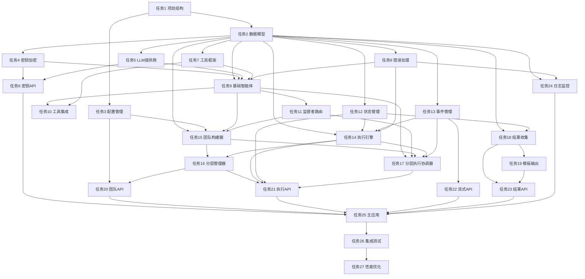

# 实施计划

## 概述

基于分层多智能体系统的设计文档，本实施计划将系统开发分解为可管理的编程任务。采用测试驱动开发方法，优先实现核心功能，确保每个步骤都能构建在前一步的基础上。

## 验证方法说明

每个任务都包含详细的验证方法，确保实现质量：

- **功能验证**：验证核心功能是否按预期工作
- **集成验证**：验证组件间的集成是否正确
- **错误处理验证**：验证异常情况的处理是否合适
- **性能验证**：验证关键性能指标是否达标

所有验证项目都应该通过才能认为任务完成。建议为每个验证项目编写自动化测试。

## 需求覆盖检查

### 需求1: 构建分层团队接口
- [x] 任务2: 核心数据模型 (实体列表和依赖关系的数据结构)
- [ ] 任务15: 团队构建器 (创建分层团队结构)
- [ ] 任务16: 分层管理器 (顶级监督者协调)
- [ ] 任务20: 团队管理API (HTTP接口)

### 需求2: 触发分层团队执行
- [ ] 任务14: 执行引擎核心 (执行工作流程)
- [ ] 任务17: 分层执行协调器 (分层执行逻辑)
- [ ] 任务21: 执行控制API (触发执行)
- [ ] 任务22: 流式事件API (实时反馈)
- [ ] 任务12: 状态管理器 (状态更新)

### 需求3: 标准化输出
- [ ] 任务18: 结果收集器 (收集执行结果)
- [ ] 任务19: 模板化输出 (标准化格式)
- [ ] 任务23: 结果查询API (输出接口)

### 需求4: 灵活的智能体配置
- [ ] 任务9: 基础智能体类 (自定义智能体)
- [ ] 任务11: 监督者智能路由 (自定义监督策略)
- [x] 任务7: 工具集成框架 (插件化扩展)
- [ ] 任务10: 工具到智能体集成 (动态工具配置)
- [x] 任务5: 多LLM提供商支持 (灵活配置)

### 需求5: 错误处理和恢复机制
- [ ] 任务8: 错误处理框架 (错误记录和重试)
- [ ] 任务24: 日志和监控 (详细日志)
- [ ] 任务14: 执行引擎核心 (优雅停止)
- [ ] 任务17: 分层执行协调器 (监督者重分配)

## 任务依赖关系

## 任务列表 (共27个任务) - 按执行顺序重新编号

### 阶段1: 基础设施和核心模型 (1-3)

- [x] **任务1: 设置项目结构和依赖**
  - 创建Python项目结构（src/hierarchical_agents/）
  - 配置pyproject.toml，包含LangGraph、LangChain、FastAPI等依赖
  - 设置开发环境配置文件
  - _需求: 1.1_
  - **验证方法:**
    - [x] 项目结构符合Python包标准（src/hierarchical_agents/__init__.py存在）
    - [ ] `pip install -e .` 成功安装项目
    - [ ] 所有必需依赖可以正常导入：`import langgraph, langchain, fastapi`
    - [ ] 开发工具配置正确：pytest、black、mypy可以运行

- [x] **任务2: 实现核心数据模型**
  - 创建data_models.py，实现所有@dataclass定义
  - 包含LLMConfig、AgentConfig、SupervisorConfig、SubTeam等
  - 添加数据验证和序列化支持
  - _需求: 1.1, 2.1_
  - _依赖: 任务1_
  - **验证方法:**
    - [-] 所有数据类可以正常实例化：`LLMConfig(provider="openai", model="gpt-4o", api_key_ref="test")`
    - [ ] Pydantic验证正常工作：无效数据抛出ValidationError
    - [ ] JSON序列化/反序列化正常：`model.model_dump()` 和 `Model.model_validate(data)`
    - [ ] 类型提示通过mypy检查：`mypy src/hierarchical_agents/data_models.py`

- [x] **任务3: 实现配置管理基础**
  - 创建config_manager.py，处理配置加载和验证
  - 支持JSON配置文件的读取和解析
  - 实现配置验证逻辑
  - _需求: 1.1_
  - _依赖: 任务2_
  - **验证方法:**
    - [x] 可以加载有效的JSON配置文件：`ConfigManager.load_config("test_config.json")`
    - [x] 无效配置被正确拒绝并提供清晰错误信息
    - [x] 配置验证覆盖所有必需字段：team_name、sub_teams、dependencies等
    - [x] 单元测试覆盖率达到90%以上

### 阶段2: 密钥管理和LLM支持 (4-6)

- [x] **任务4: 实现密钥加密存储**
  - 创建key_manager.py，实现SecureKeyManager类
  - 使用cryptography库实现AES-256加密
  - 实现密钥的安全存储和检索
  - _需求: 4.1, 5.1_
  - _依赖: 任务2_
  - **验证方法:**
    - [x] 密钥加密/解密正常工作：存储的密钥与原始密钥不同，但解密后一致
    - [x] 密钥引用系统正常：`store_key()` 返回引用，`get_key(ref)` 返回原始密钥
    - [x] 安全性测试：加密密钥不能从存储中直接读取
    - [x] 错误处理：无效引用抛出适当异常

- [x] **任务5: 实现多LLM提供商支持**
  - 创建llm_providers.py，实现LLMProviderConfig类
  - 支持OpenAI、OpenRouter、AWS Bedrock的客户端创建
  - 实现统一的LLM接口抽象
  - _需求: 4.2_
  - _依赖: 任务2, 任务4_
  - **验证方法:**
    - [x] OpenAI客户端创建成功：`create_openai_client()` 返回有效的ChatOpenAI实例
    - [x] OpenRouter客户端创建成功：正确设置base_url和headers
    - [x] AWS Bedrock客户端创建成功：正确配置region和credentials
    - [x] 统一接口测试：所有提供商的客户端都实现相同的调用接口

- [x] **任务6: 实现环境变量密钥管理**
  - 创建简化的环境变量密钥管理器
  - 支持从环境变量读取OpenAI、OpenRouter、AWS Bedrock密钥
  - 实现密钥验证和LLM客户端创建的集成
  - _需求: 4.1, 4.2_
  - _依赖: 任务2, 任务5_
  - **验证方法:**
    - [x] 环境变量读取正常：从OPENAI_API_KEY等环境变量读取密钥
    - [x] 密钥验证功能：验证不同提供商的密钥格式
    - [x] LLM客户端集成：使用环境变量密钥成功创建LLM客户端
    - [x] 错误处理：缺失环境变量时提供清晰错误信息

### 阶段3: 工具框架 (7-8)

- [x] **任务7: 实现工具集成框架**
  - 创建tools.py，定义工具接口
  - 实现基础工具（如搜索、文档处理）的集成
  - 支持动态工具加载和执行
  - _需求: 4.3_
  - _依赖: 任务2_
  - **验证方法:**
    - [x] 工具接口：定义并测试BaseTool抽象基类
    - [x] 动态加载：实现工具注册表和加载机制
    - [x] 基础工具：实现并测试搜索、文档处理工具
    - [x] 错误隔离：测试工具异常不影响调用者
    - [x] 工具链：测试多个工具的组合使用

- [x] **任务8: 实现错误处理框架**
  - 创建error_handler.py，实现ErrorHandler类
  - 支持智能体错误、网络错误、监督者失效的处理
  - 实现重试机制和降级处理
  - _需求: 5.1, 5.2_
  - _依赖: 任务2_
  - **验证方法:**
    - [x] 错误分类正确：不同类型的错误被正确识别和分类
    - [x] 重试机制有效：可恢复错误触发重试，不可恢复错误直接失败
    - [x] 降级处理：关键组件失效时系统能够降级运行
    - [x] 错误传播：错误信息正确传播到上层调用者

### 阶段4: 智能体实现 (9-11)

- [x] **任务9: 实现基础智能体类**
  - 创建agents.py，实现WorkerAgent类
  - 集成LLM配置和密钥管理
  - 实现基础的任务执行逻辑
  - _需求: 1.2, 4.3_
  - _依赖: 任务2, 任务4, 任务5, 任务7, 任务8_
  - **验证方法:**
    - [x] 智能体初始化：使用有效配置成功创建WorkerAgent实例
    - [x] Mock LLM测试：使用Mock LLM客户端验证调用逻辑
    - [x] 配置集成：验证LLMConfig正确传递给LLM客户端
    - [x] 错误处理：测试网络错误、API错误等异常场景
    - [x] 独立测试：不依赖真实LLM API进行单元测试

- [x] **任务10: 集成工具到智能体**
  - 在agents.py中添加工具使用逻辑
  - 实现智能体调用工具的接口
  - 支持工具结果的处理和传递
  - _需求: 4.3_
  - _依赖: 任务9, 任务7_
  - **验证方法:**
    - [x] 工具调用：测试智能体正确调用配置的工具
    - [x] 结果处理：验证工具输出正确传递给LLM
    - [x] 工具选择：测试智能体根据任务选择合适工具
    - [x] 异常处理：测试工具失败时的降级处理
    - [x] 工具链执行：测试复杂的多工具协作场景

- [x] **任务11: 实现监督者智能路由**
  - 在agents.py中实现SupervisorAgent类
  - 实现基于LLM的智能路由决策
  - 支持结构化输出和路由推理
  - _需求: 1.3, 4.3_
  - _依赖: 任务9_
  - **验证方法:**
    - [x] 路由决策正常工作：给定选项列表，监督者返回有效选择
    - [x] 结构化输出正确：`route_task_structured()` 返回选择和推理
    - [x] 路由逻辑合理：相同输入产生一致的路由决策
    - [x] 边界情况处理：空选项列表或无效选项时的错误处理

### 阶段5: 状态和事件管理 (12-14)

- [x] **任务12: 实现状态管理器**
  - 创建state_manager.py，实现StateManager类
  - 支持执行状态的持久化和查询
  - 集成Redis进行状态缓存
  - _需求: 2.2, 2.3_
  - _依赖: 任务2_
  - **验证方法:**
    - [x] 状态持久化正常：状态更新后可以通过execution_id查询到
    - [x] Redis集成正确：状态数据正确存储在Redis中
    - [x] 查询性能良好：状态查询响应时间<100ms
    - [x] 数据一致性：并发状态更新不会导致数据不一致

- [x] **任务13: 实现事件管理器**
  - 创建event_manager.py，实现EventManager类
  - 支持实时事件生成和流式推送
  - 实现事件的分类和格式化
  - _需求: 2.2, 2.3_
  - _依赖: 任务2_
  - **验证方法:**
    - [x] 事件生成：测试各种事件类型的生成逻辑
    - [x] 事件格式：验证事件符合ExecutionEvent数据模型
    - [x] 流式推送：使用asyncio测试事件流推送
    - [x] 事件分类：验证source_type字段正确设置
    - [x] 订阅管理：测试订阅者的添加、移除和通知

- [x] **任务14: 实现执行引擎核心**
  - 创建execution_engine.py，实现ExecutionEngine类
  - 支持异步执行和状态管理
  - 实现执行上下文和会话管理
  - _需求: 2.1, 2.2_
  - _依赖: 任务2, 任务12, 任务13, 任务8_
  - **验证方法:**
    - [x] 异步执行正常：`start_execution()` 返回可等待的协程
    - [x] 会话管理正确：每次执行创建唯一的execution_id
    - [x] 状态跟踪准确：执行状态正确从pending→running→completed转换
    - [x] 并发安全：多个执行可以并发进行而不互相干扰

### 阶段6: 团队构建 (15-16)

- [x] **任务15: 实现团队构建器**
  - 创建team_builder.py，实现TeamBuilder类
  - 根据配置创建智能体和监督者实例
  - 构建依赖关系图和执行顺序
  - _需求: 1.1, 1.4_
  - _依赖: 任务2, 任务3, 任务9, 任务11_
  - **验证方法:**
    - [x] 团队构建：使用Mock智能体工厂测试团队构建逻辑
    - [x] 依赖图算法：测试拓扑排序和依赖关系验证
    - [x] 执行顺序：验证生成的顺序满足所有依赖约束
    - [x] 循环依赖：测试A→B→C→A等循环依赖的检测
    - [x] 边界情况：测试空配置、单节点、复杂依赖等场景

- [x] **任务16: 实现分层管理器**
  - 创建hierarchical_manager.py，实现HierarchicalManager类
  - 集成团队构建、执行引擎和输出格式化
  - 实现build_hierarchy方法
  - _需求: 1.1, 1.4_
  - _依赖: 任务15, 任务14_
  - **验证方法:**
    - [x] 分层构建成功：`build_hierarchy(config)` 返回完整的HierarchicalTeam
    - [x] 组件集成正确：团队构建器、执行引擎、输出格式化器正常协作
    - [x] 接口一致性：所有方法签名与设计文档一致
    - [x] 集成测试通过：端到端的团队创建和基础执行流程正常

### 阶段7: 分层执行协调 (17)

- [x] **任务17: 实现分层执行协调器**
  - 创建hierarchical_executor.py，实现分层执行逻辑
  - 协调顶级监督者→子团队监督者→智能体的执行流程
  - 处理依赖关系和执行顺序
  - _需求: 1.1, 2.1, 2.2_
  - _依赖: 任务9, 任务11, 任务15, 任务14, 任务13_
  - **验证方法:**
    - [x] 分层执行：测试完整的三层执行流程
    - [x] 依赖处理：验证依赖团队完成后才执行下游团队
    - [x] 路由决策：测试监督者的智能路由功能
    - [x] 状态同步：验证执行状态在各层间正确传递
    - [x] 错误传播：测试错误在分层结构中的传播和处理

### 阶段8: 结果处理 (18-19)

- [x] **任务18: 实现结果收集器**
  - 创建output_formatter.py，实现OutputFormatter类
  - 收集所有团队和智能体的执行结果
  - 生成标准化的执行摘要和指标
  - _需求: 3.1, 3.3_
  - _依赖: 任务2, 任务12_
  - **验证方法:**
    - [x] 结果收集：使用Mock执行数据测试收集逻辑
    - [x] 摘要生成：验证ExecutionSummary的各字段计算
    - [x] 指标计算：测试token、API调用等指标的统计
    - [x] 数据模型：验证输出符合StandardizedOutput结构
    - [x] 边界情况：测试空结果、部分失败等场景

- [x] **任务19: 实现模板化输出**
  - 在output_formatter.py中添加模板处理
  - 支持用户自定义JSON模板
  - 实现智能的信息提取和格式化
  - _需求: 3.2_
  - _依赖: 任务18_
  - **验证方法:**
    - [x] 模板解析正确：用户提供的JSON模板被正确解析
    - [x] 信息提取准确：根据extraction_rules正确提取信息
    - [x] 格式化输出：生成的报告符合用户指定的结构
    - [x] 错误处理：模板中的无效字段或规则被正确处理

### 阶段9: HTTP API实现 (20-23)

- [x] **任务20: 实现团队管理API**
  - 创建api/teams.py，实现团队创建接口
  - POST /api/v1/hierarchical-teams
  - 集成请求验证和团队构建逻辑
  - _需求: 1.1_
  - _依赖: 任务3, 任务16_
  - **验证方法:**
    - [x] API响应格式正确：返回符合设计的JSON结构和状态码
    - [x] 请求验证有效：无效请求返回400错误和详细错误信息
    - [x] 团队创建成功：有效请求成功创建团队并返回team_id
    - [x] OpenAPI文档生成：FastAPI自动生成正确的API文档

- [x] **任务21: 实现执行控制API**
  - 创建api/executions.py，实现执行相关接口
  - POST /api/v1/hierarchical-teams/{team_id}/execute
  - GET /api/v1/executions/{execution_id}
  - _需求: 2.1_
  - _依赖: 任务16, 任务14, 任务12, 任务17_
  - **验证方法:**
    - [x] 执行启动：使用Mock执行引擎测试API逻辑
    - [x] 状态查询：验证从StateManager正确获取状态
    - [x] 参数验证：测试无效ID的错误处理
    - [x] 异步处理：验证API立即返回而不等待执行完成
    - [x] 集成测试：端到端测试执行启动和状态查询

- [x] **任务22: 实现流式事件API**
  - 在api/executions.py中添加流式接口
  - GET /api/v1/executions/{execution_id}/stream (SSE)
  - 集成事件管理器和实时推送
  - _需求: 2.2_
  - _依赖: 任务13_
  - **验证方法:**
    - [x] SSE连接：使用httpx测试SSE连接建立
    - [x] 事件推送：模拟事件生成并验证SSE推送
    - [x] 格式规范：验证事件符合Server-Sent Events标准
    - [x] 连接管理：测试客户端断开时的资源清理
    - [x] 并发连接：测试多个客户端同时连接的处理

- [x] **任务23: 实现结果查询API**
  - 在api/executions.py中添加结果接口
  - GET /api/v1/executions/{execution_id}/results
  - POST /api/v1/executions/{execution_id}/results/format
  - _需求: 3.1_
  - _依赖: 任务18, 任务19_
  - **验证方法:**
    - [x] 原始结果查询：GET接口返回完整的执行结果数据
    - [x] 模板化输出：POST接口根据用户模板生成格式化报告
    - [x] 模板验证：无效模板返回400错误和清晰错误信息
    - [x] 结果完整性：返回的结果包含所有团队和智能体的输出

### 阶段10: 日志监控 (24)

- [x] **任务24: 实现日志和监控**
  - 集成结构化日志记录
  - 添加执行指标收集和统计
  - 实现审计日志功能
  - _需求: 5.3, 5.4_
  - _依赖: 任务2, 任务8_
  - **验证方法:**
    - [x] 日志格式标准：所有日志采用结构化格式（JSON）
    - [x] 日志级别正确：不同重要性的事件使用适当的日志级别
    - [x] 指标收集准确：执行指标被正确收集和统计
    - [x] 审计完整性：所有关键操作都有审计日志记录

### 阶段11: 系统集成和测试 (25-27)

- [x] **任务25: 实现主应用入口**
  - 创建main.py，集成FastAPI应用
  - 配置所有路由和中间件
  - 实现应用启动和关闭逻辑
  - _需求: 1.1, 2.1, 3.1_
  - _依赖: 任务6, 任务20, 任务21, 任务22, 任务23, 任务24_
  - **验证方法:**
    - [x] 应用启动成功：`uvicorn main:app` 成功启动服务
    - [x] 所有路由可访问：API文档显示所有定义的端点
    - [x] 中间件正常：CORS、日志、错误处理中间件正常工作
    - [x] 优雅关闭：应用可以正确处理关闭信号并清理资源

- [x] **任务26: 端到端集成测试**
  - 创建完整的工作流测试
  - 测试从团队创建到结果输出的完整流程
  - 验证流式事件和错误处理
  - _需求: 1.1, 1.2, 1.3, 1.4, 2.1, 2.2, 2.3, 3.1, 3.2, 3.3, 4.1, 4.2, 4.3, 5.1, 5.2, 5.3, 5.4_
  - _依赖: 任务25_
  - **验证方法:**
    - [x] 需求1验证：测试分层团队构建的完整功能
    - [x] 需求2验证：测试执行触发和流式反馈功能
    - [x] 需求3验证：测试标准化输出和模板化报告
    - [x] 需求4验证：测试智能体配置和工具集成的灵活性
    - [x] 需求5验证：测试错误处理和系统稳定性
    - [x] 性能测试：验证系统在负载下的表现
    - [x] 兼容性测试：测试不同LLM提供商的兼容性

- [x] **任务27: 性能优化和监控集成**
  - 添加性能监控和指标收集
  - 优化并发执行和资源使用
  - 集成Prometheus监控（可选）
  - _需求: 4.1, 5.1_
  - _依赖: 任务26_
  - **验证方法:**
    - [x] 性能指标收集：关键性能指标被正确收集和暴露
    - [x] 并发性能良好：系统可以处理多个并发执行请求
    - [x] 资源使用合理：内存和CPU使用在正常范围内
    - [x] 监控集成成功：Prometheus可以正确抓取指标数据