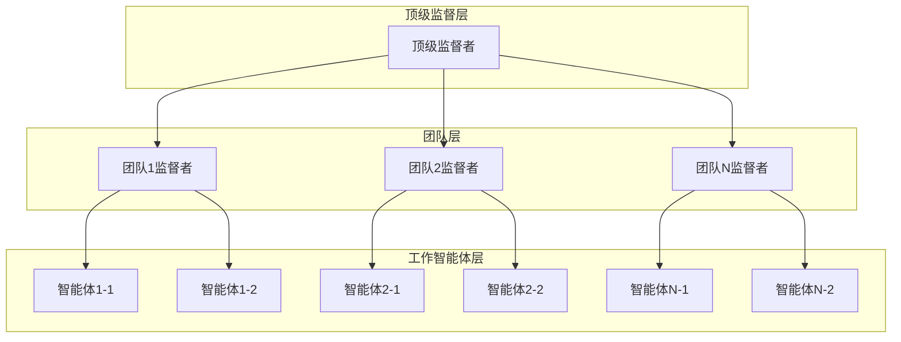

# 分层多智能体协作系统 (Hierarchical Multi-Agent System)

基于 LangGraph 框架的分层多智能体协作系统，采用监督者-工作者（Supervisor-Worker）架构，支持动态构建具有依赖关系的智能体团队，通过分层监督机制实现复杂任务的分解和协调执行。

## 🚀 核心特性

- **分层架构**：顶级监督者 → 中级监督者 → 工作智能体的三层架构
- **智能路由**：监督者基于 LLM 进行智能任务分配和路由决策
- **流式执行**：实时状态更新和结果流式返回
- **多 LLM 支持**：支持 OpenAI、OpenRouter、AWS Bedrock 等多种 LLM 提供商
- **安全密钥管理**：AES-256 加密存储 API 密钥，支持密钥轮换
- **标准化输出**：统一的结果格式和模板化报告生成
- **可扩展性**：插件化的智能体和工具管理

## 📋 系统架构



## 🛠️ 技术栈

- **核心框架**：LangGraph、LangChain、FastAPI
- **异步处理**：AsyncIO
- **数据验证**：Pydantic
- **状态管理**：Redis
- **安全加密**：cryptography
- **API 文档**：OpenAPI/Swagger
- **实时通信**：WebSocket/SSE

## 📦 安装

### 环境要求

- Python 3.9+
- Redis (用于状态管理)

### 安装步骤

1. 克隆仓库
```bash
git clone https://github.com/catface996/hierarchical-agents.git
cd hierarchical-agents
```

2. 创建虚拟环境
```bash
python -m venv venv
source venv/bin/activate  # Linux/macOS
# 或
venv\Scripts\activate  # Windows
```

3. 安装依赖
```bash
pip install -e .
```

4. 启动 Redis
```bash
redis-server
```

5. 启动应用
```bash
uvicorn main:app --reload
```

## 🔧 配置

### LLM 提供商配置

支持多种 LLM 提供商，通过 API 密钥管理系统安全存储：

#### OpenAI
```json
{
  "provider": "openai",
  "model": "gpt-4o",
  "api_key_ref": "openai_key_001",
  "temperature": 0.7
}
```

#### OpenRouter
```json
{
  "provider": "openrouter", 
  "model": "anthropic/claude-3-sonnet",
  "api_key_ref": "openrouter_key_001",
  "base_url": "https://openrouter.ai/api/v1"
}
```

#### AWS Bedrock
```json
{
  "provider": "aws_bedrock",
  "model": "anthropic.claude-3-sonnet-20240229-v1:0",
  "api_key_ref": "aws_bedrock_key_001",
  "region": "us-east-1"
}
```

## 🚀 快速开始

### 1. 创建分层团队

```bash
curl -X POST "http://localhost:8000/api/v1/hierarchical-teams" \
  -H "Content-Type: application/json" \
  -d '{
    "team_name": "research_analysis_team",
    "description": "研究分析团队",
    "top_supervisor_config": {
      "llm_config": {
        "provider": "openai",
        "model": "gpt-4o",
        "api_key_ref": "openai_key_001"
      },
      "system_prompt": "你是顶级监督者，负责协调整个团队执行",
      "user_prompt": "请选择最适合的子团队执行任务"
    },
    "sub_teams": [...],
    "dependencies": {...}
  }'
```

### 2. 触发执行

```bash
curl -X POST "http://localhost:8000/api/v1/hierarchical-teams/{team_id}/execute" \
  -H "Content-Type: application/json" \
  -d '{
    "execution_config": {
      "stream_events": true,
      "save_intermediate_results": true
    }
  }'
```

### 3. 监听实时事件

```bash
curl -N "http://localhost:8000/api/v1/executions/{execution_id}/stream"
```

### 4. 获取结果

```bash
curl "http://localhost:8000/api/v1/executions/{execution_id}/results"
```

## 📚 API 文档

启动应用后，访问以下地址查看完整的 API 文档：

- **Swagger UI**: http://localhost:8000/docs
- **ReDoc**: http://localhost:8000/redoc

### 主要 API 端点

| 方法 | 端点 | 描述 |
|------|------|------|
| POST | `/api/v1/hierarchical-teams` | 创建分层团队 |
| POST | `/api/v1/hierarchical-teams/{team_id}/execute` | 触发团队执行 |
| GET | `/api/v1/executions/{execution_id}/stream` | 获取实时事件流 |
| GET | `/api/v1/executions/{execution_id}/results` | 获取执行结果 |
| POST | `/api/v1/executions/{execution_id}/results/format` | 生成格式化报告 |
| POST | `/api/v1/keys` | 管理 API 密钥 |

## 🔐 安全特性

### 密钥管理
- **加密存储**：所有 API 密钥使用 AES-256 加密
- **密钥引用**：配置中只存储密钥引用，不存储实际密钥
- **访问控制**：密钥管理需要管理员权限
- **审计日志**：记录所有密钥操作
- **密钥轮换**：支持定期密钥轮换

### 数据安全
- **输入验证**：所有 API 输入都经过严格验证
- **错误处理**：敏感信息不会在错误消息中泄露
- **日志脱敏**：日志中自动脱敏敏感信息

## 📊 监控和日志

### 结构化日志
- **JSON 格式**：所有日志采用结构化 JSON 格式
- **分级记录**：支持 DEBUG、INFO、WARNING、ERROR 级别
- **审计跟踪**：完整的操作审计链

### 性能监控
- **执行指标**：Token 使用量、API 调用次数、响应时间
- **系统指标**：内存使用、CPU 占用、并发连接数
- **业务指标**：团队执行成功率、智能体性能统计

## 🧪 测试

### 运行测试
```bash
# 运行所有测试
pytest

# 运行特定测试
pytest tests/test_agents.py

# 生成覆盖率报告
pytest --cov=src/hierarchical_agents --cov-report=html
```

### 测试覆盖
- **单元测试**：核心组件功能测试
- **集成测试**：组件间协作测试
- **端到端测试**：完整工作流测试
- **性能测试**：并发和负载测试

## 🚧 开发状态

项目目前处于开发阶段，按照以下里程碑进行：

### Phase 1: 核心基础 ✅
- [x] 项目结构和数据模型
- [x] 密钥管理系统
- [x] 基础智能体实现

### Phase 2: 团队管理 🚧
- [ ] 团队构建器
- [ ] 分层管理器
- [ ] 执行引擎

### Phase 3: API 接口 📋
- [ ] REST API 实现
- [ ] 流式事件接口
- [ ] 结果格式化

### Phase 4: 系统集成 📋
- [ ] 错误处理框架
- [ ] 监控和日志
- [ ] 性能优化

详细的开发任务请查看 [tasks.md](.kiro/specs/hierarchical-multi-agent/tasks.md)

## 🤝 贡献

欢迎贡献代码！请遵循以下步骤：

1. Fork 项目
2. 创建特性分支 (`git checkout -b feature/AmazingFeature`)
3. 提交更改 (`git commit -m 'Add some AmazingFeature'`)
4. 推送到分支 (`git push origin feature/AmazingFeature`)
5. 开启 Pull Request

### 开发规范
- 遵循 PEP 8 代码风格
- 添加适当的类型注解
- 编写单元测试
- 更新相关文档

## 📄 许可证

本项目采用 MIT 许可证 - 查看 [LICENSE](LICENSE) 文件了解详情

## 📞 联系方式

- **项目维护者**: catface996
- **GitHub**: https://github.com/catface996/hierarchical-agents
- **问题反馈**: https://github.com/catface996/hierarchical-agents/issues

## 🙏 致谢

- [LangGraph](https://github.com/langchain-ai/langgraph) - 智能体编排框架
- [LangChain](https://github.com/langchain-ai/langchain) - LLM 应用开发框架
- [FastAPI](https://github.com/tiangolo/fastapi) - 现代 Web 框架

## 📈 路线图

### 短期目标 (Q1 2024)
- [ ] 完成核心功能开发
- [ ] 发布 v1.0.0 版本
- [ ] 完善文档和示例

### 中期目标 (Q2-Q3 2024)
- [ ] 添加更多 LLM 提供商支持
- [ ] 实现高级监控和分析功能
- [ ] 支持分布式部署

### 长期目标 (Q4 2024+)
- [ ] 可视化团队构建界面
- [ ] 智能体市场和插件生态
- [ ] 企业级功能和支持

---

**注意**: 本项目仍在积极开发中，API 可能会发生变化。建议在生产环境使用前等待稳定版本发布。