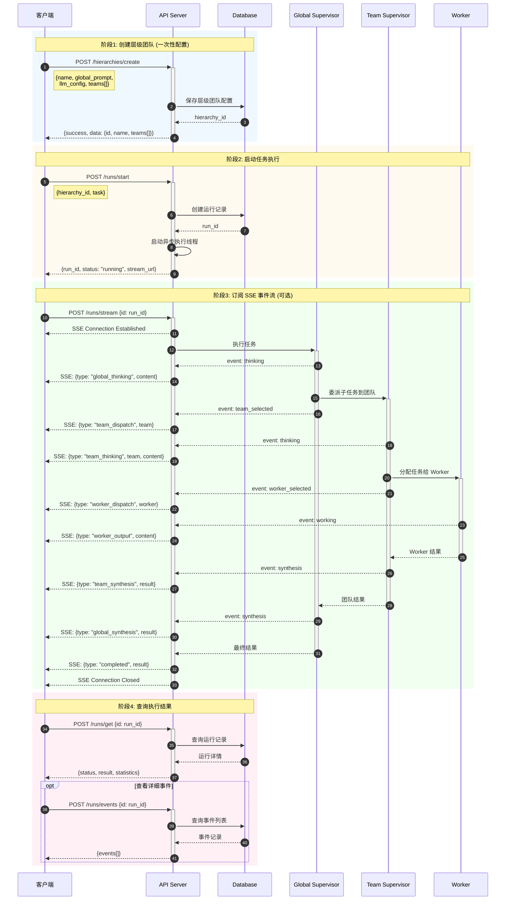

# 层级多智能体系统 (Hierarchical Multi-Agent System)

基于 [Strands Agents SDK](https://github.com/strands-agents/sdk-python) 构建的动态层级团队协作系统，支持通过 HTTP API 动态创建和执行多智能体拓扑结构。

## 核心特性

- **动态层级架构**: Global Supervisor → Team Supervisor → Worker Agent
- **严格任务委派**: Global/Team Supervisor 强制委派任务，不直接回答
- **迭代工作流程**: THINK → SELECT → DISPATCH → SYNTHESIS
- **清晰输出标识**: `[Global Supervisor]` / `[Team: X | Supervisor]` / `[Team: X | Worker: Y]`
- **HTTP API**: RESTful API 支持动态创建层级团队和流式执行
- **多平台 Docker**: 支持 linux/amd64 和 linux/arm64 (Mac M1/M2, AWS Graviton)
- **灵活认证**: 支持 API Key / AK-SK / IAM Role 三种认证方式

## 系统架构


## 快速开始

### 方式 1: Docker Compose 部署 (推荐)

```bash
# 克隆代码
git clone https://github.com/catface996/hierarchical-agents.git
cd hierarchical-agents

# 配置环境变量
cp .env.example .env
# 编辑 .env 文件，配置 AWS 认证

# 启动服务
docker-compose up -d

# 验证服务
curl http://localhost:8080/health
```

### 方式 2: 使用预构建镜像

```bash
# 拉取镜像 (自动选择正确架构)
docker pull catface996/hierarchical-agents:latest

# 使用生产配置启动
docker-compose -f docker-compose.prod.yml up -d
```

### 方式 3: 本地开发

```bash
# 安装依赖
pip install -r requirements.txt

# 配置环境变量
export AWS_BEDROCK_API_KEY='your-api-key'
export AWS_REGION='us-east-1'

# 启动服务
python -m src.ec2.server
```

## AWS 认证配置

系统支持三种认证方式，按优先级自动选择：

| 优先级 | 方式 | 环境变量 | 适用场景 |
|--------|------|----------|----------|
| 1 | API Key | `AWS_BEDROCK_API_KEY` | 本地开发、测试 |
| 2 | AK/SK | `AWS_ACCESS_KEY_ID` + `AWS_SECRET_ACCESS_KEY` | 跨账号访问 |
| 3 | IAM Role | `USE_IAM_ROLE=true` | EC2/Lambda 部署 |

```bash
# API Key 认证
export AWS_BEDROCK_API_KEY='your-api-key'

# 或 AK/SK 认证
export AWS_ACCESS_KEY_ID='your-ak'
export AWS_SECRET_ACCESS_KEY='your-sk'

# 或 IAM Role 认证 (EC2/Lambda)
export USE_IAM_ROLE=true
```

## API 使用示例

### 创建层级团队

```bash
curl -X POST http://localhost:8080/api/executor/v1/hierarchies/create \
  -H "Content-Type: application/json" \
  -d '{
    "name": "研究团队",
    "global_prompt": "你是研究团队的协调者",
    "teams": [
      {
        "name": "分析组",
        "supervisor_prompt": "你是分析组负责人",
        "workers": [
          {"name": "分析师", "role": "数据分析", "system_prompt": "你是数据分析专家"}
        ]
      }
    ]
  }'
```

### 执行任务

```bash
curl -X POST http://localhost:8080/api/executor/v1/runs/start \
  -H "Content-Type: application/json" \
  -d '{
    "hierarchy_id": "your-hierarchy-id",
    "task": "分析这个问题..."
  }'
```

### 流式测试

```bash
# 自动获取第一个层级团队
python test_stream.py "你的问题"

# 指定层级团队
python test_stream.py --hierarchy=ID "你的问题"

# 指定远程 API
python test_stream.py --api=http://ec2-ip:8080 "你的问题"
```

## 项目结构

```
hierarchical-agents/
├── src/
│   ├── core/                    # 核心系统
│   │   ├── hierarchy_system.py  # 层级系统实现
│   │   ├── hierarchy_executor.py# 执行器
│   │   ├── output_formatter.py  # 输出格式化
│   │   └── config.py            # 配置管理
│   ├── db/                      # 数据库模块
│   │   ├── models.py            # SQLAlchemy 模型
│   │   └── database.py          # 数据库连接
│   ├── api/                     # API 路由
│   │   └── routes/              # 路由定义
│   └── ec2/                     # EC2 部署
│       └── server.py            # Flask 服务器
├── test_stream.py               # 流式测试脚本
├── build-multiarch.sh           # 多平台构建脚本
├── docker-compose.yml           # 开发环境配置
├── docker-compose.prod.yml      # 生产环境配置
└── Dockerfile                   # 多平台 Docker 镜像
```

## API 端点

| 端点 | 描述 |
|------|------|
| `GET /health` | 健康检查 |
| `GET /swagger` | Swagger 文档 |
| `POST /api/executor/v1/models/list` | 列出模型 |
| `POST /api/executor/v1/models/create` | 创建模型 |
| `POST /api/executor/v1/hierarchies/list` | 列出层级团队 |
| `POST /api/executor/v1/hierarchies/create` | 创建层级团队 |
| `POST /api/executor/v1/hierarchies/get` | 获取层级详情 |
| `POST /api/executor/v1/hierarchies/update` | 更新层级团队 |
| `POST /api/executor/v1/hierarchies/delete` | 删除层级团队 |
| `POST /api/executor/v1/runs/start` | 启动执行 |
| `POST /api/executor/v1/runs/get` | 获取执行状态 |
| `POST /api/executor/v1/runs/stream` | 流式获取事件 (SSE) |
| `POST /api/executor/v1/runs/list` | 获取运行列表 |
| `POST /api/executor/v1/runs/cancel` | 取消运行 |
| `POST /api/executor/v1/runs/events` | 获取运行事件列表 |

## API 调用时序图

以下时序图展示了如何组合 **层级团队管理 API** 和 **运行管理 API** 来完成多智能体协作任务：



### 典型调用流程

```bash
# Step 0: 获取可用模型列表，选择一个模型 ID
curl -s -X POST http://localhost:8080/api/executor/v1/models/list \
  -H "Content-Type: application/json" -d '{}' | jq '.data.items[] | {id, name}'

# 示例输出:
# { "id": "abc123-...", "name": "Claude Sonnet 4" }
# { "id": "def456-...", "name": "Claude Opus 4" }

# 设置模型 ID (替换为实际的模型 ID)
MODEL_ID="your-model-id-here"

# Step 1: 创建层级团队 (仅需一次)
HIERARCHY_ID=$(curl -s -X POST http://localhost:8080/api/executor/v1/hierarchies/create \
  -H "Content-Type: application/json" \
  -d "{
    \"name\": \"研究团队\",
    \"global_prompt\": \"你是研究协调者，负责分析任务并分配给合适的团队\",
    \"llm_config\": {\"model_id\": \"$MODEL_ID\", \"temperature\": 0.7, \"max_tokens\": 4096},
    \"teams\": [{
      \"name\": \"分析组\",
      \"supervisor_prompt\": \"你是分析组负责人\",
      \"llm_config\": {\"model_id\": \"$MODEL_ID\", \"temperature\": 0.6},
      \"workers\": [{
        \"name\": \"分析师\",
        \"role\": \"数据分析专家\",
        \"system_prompt\": \"你是数据分析专家，擅长深度分析问题\",
        \"llm_config\": {\"model_id\": \"$MODEL_ID\", \"temperature\": 0.5}
      }]
    }]
  }" | jq -r '.data.id')

echo "Created hierarchy: $HIERARCHY_ID"

# Step 2: 启动任务执行
RUN_ID=$(curl -s -X POST http://localhost:8080/api/executor/v1/runs/start \
  -H "Content-Type: application/json" \
  -d "{\"hierarchy_id\": \"$HIERARCHY_ID\", \"task\": \"分析人工智能的发展趋势\"}" \
  | jq -r '.data.id')

echo "Started run: $RUN_ID"

# Step 3: 流式获取执行过程 (SSE) - 需要在启动后立即调用
curl -N -X POST http://localhost:8080/api/executor/v1/runs/stream \
  -H "Content-Type: application/json" \
  -d "{\"id\": \"$RUN_ID\"}"

# Step 4: 或者轮询获取结果
curl -s -X POST http://localhost:8080/api/executor/v1/runs/get \
  -H "Content-Type: application/json" \
  -d "{\"id\": \"$RUN_ID\"}" | jq
```

> **注意**: `model_id` 是可选的。如果不指定，系统将使用 AI 模型表中配置的默认参数。但建议明确指定以确保使用正确的模型。

### SSE 事件类型

| 事件类型 | 描述 | 数据字段 |
|----------|------|----------|
| `execution_started` | 执行开始 | `task`, `hierarchy_id` |
| `global_thinking` | Global Supervisor 思考 | `content` |
| `team_dispatch` | 任务分派到团队 | `team`, `task` |
| `team_thinking` | Team Supervisor 思考 | `team`, `content` |
| `worker_dispatch` | 任务分派到 Worker | `team`, `worker`, `task` |
| `worker_output` | Worker 输出 | `team`, `worker`, `content` |
| `team_synthesis` | 团队结果综合 | `team`, `result` |
| `global_synthesis` | 全局结果综合 | `result` |
| `execution_completed` | 执行完成 | `result`, `statistics` |
| `execution_failed` | 执行失败 | `error` |

## 多平台 Docker 构建

```bash
# 登录 Docker Hub
docker login

# 构建并推送多平台镜像
./build-multiarch.sh

# 或手动构建
docker buildx build --platform linux/amd64,linux/arm64 \
  -t catface996/hierarchical-agents:latest \
  --push .
```

## 文档

- [EC2 Docker 快速部署](docs/EC2_DOCKER_QUICKSTART.md) - Docker Compose 部署和测试
- [完整部署指南](docs/EC2_DEPLOYMENT_GUIDE.md) - 详细 EC2 部署步骤
- [认证配置指南](docs/AUTHENTICATION_GUIDE.md) - AWS 认证详细说明
- [API 参考文档](docs/API_REFERENCE.md) - 完整 API 文档
- [配置说明](docs/CONFIGURATION.md) - 配置选项详解

## 技术栈

- **Strands Agents SDK** - Agent 框架
- **AWS Bedrock** - LLM 服务 (Claude Sonnet 4)
- **Flask** - HTTP API 框架
- **SQLAlchemy** - ORM
- **MySQL** - 数据持久化
- **Docker** - 容器化部署
- **Python 3.12+** - 开发语言

## 许可证

MIT License

## 作者

Built with Strands Agents SDK
